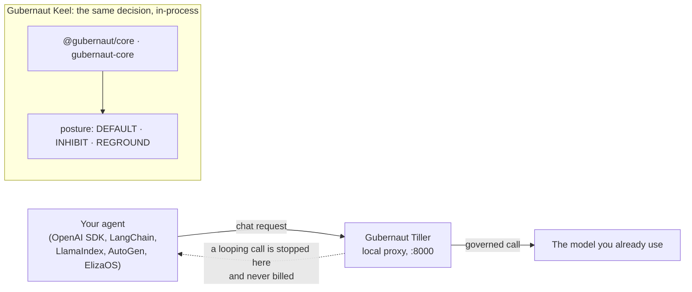

# Gubernaut

**A runtime control layer for AI agents. It stops a runaway loop before the next call is billed.**

[](https://www.apache.org/licenses/LICENSE-2.0)
[](https://arxiv.org/abs/2607.24339)
[](https://doi.org/10.5281/zenodo.21303518)
[](https://gubernaut.com)

An agent stuck in a loop keeps paying for turns that make no progress. Gubernaut watches three
numbers about each turn (**intensity, valence, repetition**), never the words, and a
deterministic controller decides the posture: carry on, hold back, or stop. Same input, same
decision, every run.

---

## One controller, two ways to run it



| | What it is | Install | Code |
|---|---|---|---|
| **Gubernaut Tiller** | A local proxy that speaks the OpenAI API. It stops a looping call itself. | `pip install gubernaut-sdk` | [thegubernaut/tiller](https://github.com/thegubernaut/tiller) |
| **Gubernaut Keel** | A library inside the program. It decides; the program does the stopping. | `npm install @gubernaut/core` · `cargo add gubernaut-core` | [thegubernaut/keel](https://github.com/thegubernaut/keel) |
| ElizaOS plugin | A client of Tiller. It does nothing without the proxy running. | `npm install @gubernaut/plugin-gcc` | [thegubernaut/gubernaut](https://github.com/thegubernaut/gubernaut) |

**Start Tiller, then point the client at it.** Both lines are needed: nothing listens on port 8000
until the proxy is running.

```bash
pip install gubernaut-sdk
gubernaut-proxy --upstream https://api.openai.com
```

```python
client = OpenAI(base_url="http://localhost:8000/v1")
```

---

## What it measured

**Spend.** On the pre-registered receipts benchmark, a runaway loop governed by Tiller cost
**4.1% to 20.2%** of the ungoverned bill. In other words it saved **79.8% to 95.9%**, across
seven measured configurations in four model families, with both arms making the same number
of attempts. The hard stop lands at turn 4, and turns 1 to 3 are sent and billed.

**Behaviour.** Across four frontier model families, each one's replies judged by all four, the
governed arm was calmer in **15/16** generator×judge cells by sign and **13/16 at p<.05**.
**One cell is a null: −0.04, GPT×Gemini.** It sits on the calmest host and is reported beside the
headline everywhere the headline appears.

**Scope.** Injection resistance is claimed for the controller only, the part that reads numbers
and no text. That boundary is architectural and not yet adversarially tested. The part that writes
the reply reads text by necessity, and its compliance is measured, not assumed.

---

## The repositories

| Repository | What is in it |
|---|---|
| [**gubernaut**](https://github.com/thegubernaut/gubernaut) | The main copy of the code: the Python proxy, the JavaScript and Rust controllers, the ElizaOS plugin, the engineering receipts and the bench |
| [**tiller**](https://github.com/thegubernaut/tiller) | The same code, with a front page that explains Tiller in plain language |
| [**keel**](https://github.com/thegubernaut/keel) | The same code, with a front page that explains Keel in plain language |
| [**Gubernaut_Validation**](https://github.com/thegubernaut/Gubernaut_Validation) | The paper's evidence: transcripts, judge panels, the sealed matrices, and the scripts that recompute the headline. The data is sealed by SHA-256 and timestamped |

**The paper:** *Gubernaut: A Deterministic Homeostatic Controller for Affect-Regulated LLM
Agents, Validated Across Independent Model Families.* [arXiv 2607.24339](https://arxiv.org/abs/2607.24339) ·
[DOI 10.5281/zenodo.21303518](https://doi.org/10.5281/zenodo.21303518) (the concept DOI, which
always resolves to the latest version) · [PDF](https://gubernaut.com/paper/gubernaut_whitepaper.pdf)

**See the runs:** [gubernaut.com/research](https://gubernaut.com/research) has the paper, the
results and a recorded dashboard of every sealed run. It is a recorded run replay with no live API.

---

Code under Apache-2.0, research data under CC-BY-4.0. Free and self-hosted, with no account, and
nothing is sent back to the lab. Questions: [contact@gubernaut.com](mailto:contact@gubernaut.com)
or [GitHub issues](https://github.com/thegubernaut/gubernaut/issues).
